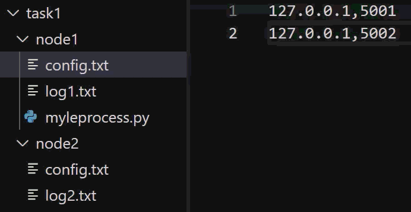
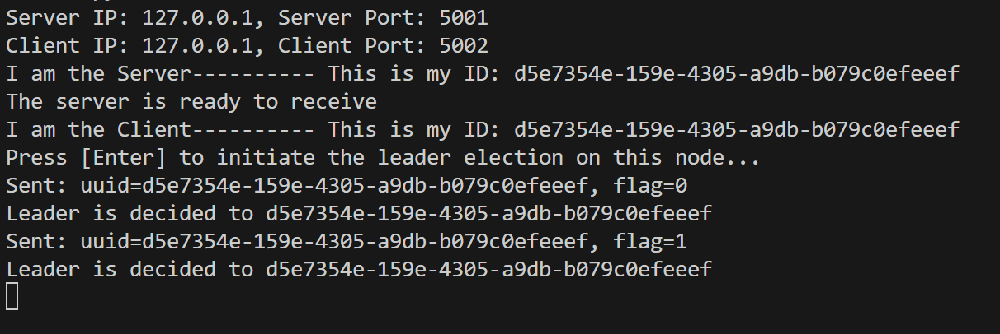
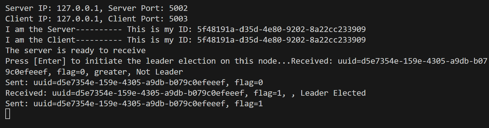
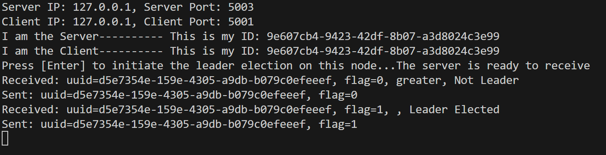

# Task 1: Distributed Leader Election (Single Ring Topology)

## Overview

Task 1:
- Implements a distributed leader election algorithm for a **single ring topology** using Python and threading.
- Each node communicates with its neighbors to elect a leader based on UUIDs.

---

## File Structure

- **`myleprocess.py`**: Main implementation for Task 1.
- **Config files**: `config.txt` — Node IP and port configuration.
- **Log files**: `log.txt` — Activity logs for each node.
- **Makefile**: Convenient commands for running nodes.

---

## How to Run

### 1. Navigate To Directories

Open a separate terminal for each node, and navigate to their respective directories under `task1/`:

```
task1/node1
task1/node2
task1/node3
```

### 2. Start Each Node

Run the following command in each terminal

```sh
python3 myleprocess.py
```

> **Note:**  
> - Each node uses its directory and own config file (`config.txt`).
> - Node numbers must match the configuration.

### 3. Initiate Leader Election

- The initiator node will automatically send the initial election message.
- Other nodes will participate upon receiving messages.

### 4. Initiate the Election

After all nodes are running, **choose ONLY ONE node to act as the initiator**.  
On that node’s terminal, **press [Enter]** when prompted to start the leader election process.

- Only one node should initiate the election per run.
- Other nodes should remain running and will participate automatically upon receiving messages.

---

## Example Usage

```sh
python3 myleprocess.py 1    # Node 1
python3 myleprocess.py 2    # Node 2
python3 myleprocess.py 3    # Node 3
...
```

---

## Sample Output Screenshots

Below are screenshots showing example terminal output and log files from a successful leader election run:

### Sample Config Setup File
<div style="margin-left: 40px;">
  
</div>

### Node 1 Terminal Output
<div style="margin-left: 40px;">
  
</div>

### Node 2 Terminal Output
<div style="margin-left: 40px;">
  
</div>

### Node 3 Terminal Output
<div style="margin-left: 40px;">
  
</div>

---

## Log Files

- Logs are written to `log.txt`.
- Each run overwrites previous logs.

---

## Notes

- Ensure all nodes are started before initiating the election.
- Check log files for debugging and verification.

---

## Contact

For questions or issues, contact the course staff or open an issue in your repository.